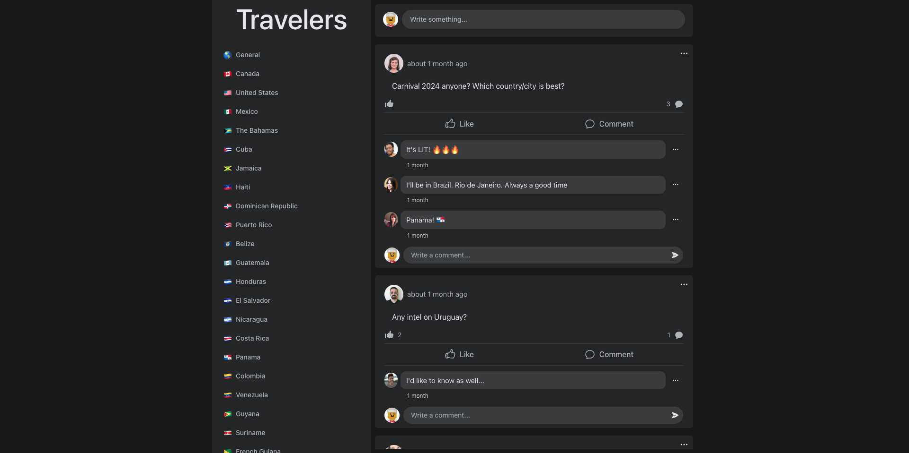

# Travelers

A Facebook Groups clone - CRUD MERN app hosted on Railway - users can view, add, edit, & delete posts, replies/comments, & likes

**Link to project:** https://travelers-group.netlify.app

## 🚀 How It's Made:

**Tech used:** [Vite](https://vitejs.dev), [React](https://react.dev), [Tailwind CSS](https://tailwindcss.com/), [Node.js](https://nodejs.org), [Express](https://expressjs.com), [MongoDB](https://www.mongodb.com), [Render](https://render.com)

## 🧞 Commands

### :root

These commands are run from the root directory of the project, from a terminal:

| Command       | Action                                                                                               |
| :------------ | :--------------------------------------------------------------------------------------------------- |
| `npm install` | Installs dependencies                                                                                |
| `npm run dev` | Starts both local backend & frontend dev servers at `localhost:3000` & `localhost:5173` respectively |

### Backend

These commands are run from the 'backend' directory of the project, from a terminal:

| Command       | Action                                                                    |
| :------------ | :------------------------------------------------------------------------ |
| `npm install` | Installs dependencies                                                     |
| `npm start`   | Starts local backend dev server at `localhost:3000`                       |
| `npm run dev` | Starts local backend dev server at `localhost:3000` & watches for changes |

### Frontend

These commands are run from the 'frontend' directory of the project, from a terminal:

| Command           | Action                                               |
| :---------------- | :--------------------------------------------------- |
| `npm install`     | Installs dependencies                                |
| `npm run dev`     | Starts local frontend dev server at `localhost:5173` |
| `npm run build`   | Build your production site to `./dist/`              |
| `npm run preview` | Preview your build locally, before deploying         |
